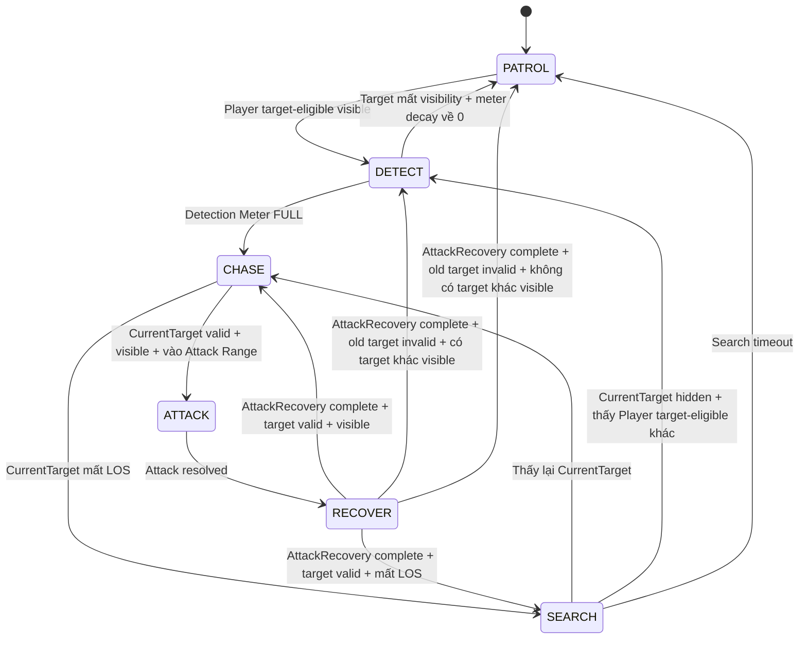

# ECHO PROTOCOL — M1-013 Stalker FSM + Sensor Contracts

**Task:** M1-013 — Stalker FSM + Sensor Contracts  
**Owner:** C — AI / Telemetry / Research  
**Status:** DONE / FROZEN  
**Scope:** Stalker runtime FSM, Vision/LOS perception contract, target selection boundary, Last Known Position ownership, navigation boundary, NoiseEvent exclusion boundary, configurable parameters và acceptance criteria.

---

## 1. Purpose

Tài liệu này freeze contract implementation cho **The Stalker** trong ECHO PROTOCOL.

Mục tiêu:

- giữ nguyên gameplay behavior của Stalker đã được chốt;
- chuyển mô tả FSM hiện tại thành contract có thể implement trực tiếp;
- xác định rõ trách nhiệm giữa `Vision Sensor`, `Target Selection`, `FSM`, `Navigation` và gameplay systems;
- bảo đảm Stalker không nhận thông tin ngoài perception hợp lệ;
- tránh việc implementation tự thêm hearing, omniscient tracking hoặc state mới;
- tạo baseline để Unity/AI implementation và test không phải tự suy đoán behavior.

M1-013 chỉ freeze **Stalker FSM + Sensor Contracts**.

Trong task này không yêu cầu:

- implement Listener Hearing behavior;
- implement Warden Route Control behavior;
- implement AED;
- implement telemetry aggregation;
- freeze các tuning number bằng giá trị cuối cùng;
- thêm Machine Learning hoặc GenAI vào monster runtime.

---

## 2. Architecture Boundary

Monster runtime behavior của Stalker thuộc **Traditional AI**.

Các thành phần logic:

```text
Player / World State
        ↓
   Vision Sensor
        ↓
 Visible Observations
        ↓
 Target Selection
        ↓
   Stalker FSM
        ↓
 Search / Attack / Navigation Requests
        ↓
 Navigation / Gameplay Systems
```

Trách nhiệm được tách như sau:

| Component | Responsibility |
|---|---|
| `Vision Sensor` | Chỉ xác định physical visibility của Player bằng distance / angle / Vision LOS |
| `Target Selection` | Lọc target eligibility theo Player state và chọn gameplay target theo rule đã freeze |
| `Stalker FSM` | Điều khiển state và transition |
| `Last Known Position` | Lưu vị trí cuối cùng thực sự quan sát được của Current Target |
| `Navigation` | Di chuyển tới destination được Stalker AI yêu cầu |
| `Attack Logic` | Xử lý wind-up, hit moment, hit/miss và recover |
| `Telemetry` | Chỉ ghi nhận kết quả gameplay; không điều khiển Stalker |
| `AED / Scenario Configuration` | Chỉ cung cấp configurable parameters được cho phép |

Không tồn tại luồng:

```text
Telemetry → Stalker decision
GenAI → Stalker FSM
AED → CHASE / ATTACK / SEARCH trực tiếp
Runtime NoiseEvent → Stalker detection
```

---

## 3. Stalker Identity

`The Stalker` là monster tập trung vào **Line of Sight (LOS)**.

Áp lực chính:

- phát hiện Player khi có LOS hợp lệ;
- tích Detection Meter;
- Chase target đã được acquire;
- Search tại vị trí cuối cùng thực sự nhìn thấy target sau khi mất LOS.

Counterplay của Player:

- cắt LOS bằng tường hoặc góc kiến trúc;
- dùng Closed Door để block LOS và đường đi của Stalker;
- đổi route;
- Sprint ra khỏi Attack Range trước Hit Moment.

Stalker không dùng Sound/Hearing làm perception source trong baseline này.

---

# 4. Vision Sensor Contract

## 4.1. Responsibility

`Vision Sensor` chỉ trả về **physical perception facts**. Nó không sở hữu gameplay target eligibility.

Vision Sensor:

```text
World / Player Candidates
        ↓
distance + angle + LOS validation
        ↓
VisibleObservations[]
```

Một `VisibleObservation` chỉ có nghĩa là Player đang **physically visible** theo Vision contract tại thời điểm observation được tạo. Observation đó không có nghĩa Player được phép trở thành `DetectionTarget` hoặc `CurrentTarget`.

Ví dụ:

```text
Downed Player
→ Vision Sensor vẫn có thể tạo VisibleObservation nếu physical visibility hợp lệ
→ Target Selection loại Player đó khỏi target candidate
```

Vision Sensor không được:

- tự chuyển FSM state;
- tự quyết định `CHASE`;
- tự quyết định `ATTACK`;
- giữ `DetectionTarget`;
- giữ `CurrentTarget`;
- tự cập nhật gameplay target;
- quyết định Player `Downed`, `DEAD / Soul` hoặc Player state khác có target-eligible hay không;
- tự lọc gameplay target eligibility;
- đọc Telemetry để tìm Player;
- sử dụng Runtime NoiseEvent để phát hiện Player.

---

## 4.2. Input Contract

Logical input của Vision Sensor gồm:

```text
observer position
observer forward direction
candidate Players
VisionDistance
VisionAngle
LOS blocker configuration / collision query
```

`candidate Players` là tập Player mà perception system được phép kiểm tra physical visibility. Gameplay target eligibility không phải input decision của Vision Sensor.

Tên class/struct cụ thể là implementation-defined, nhưng semantic contract phải giữ nguyên.

---

## 4.3. Output Contract

Logical output:

```text
VisibleObservations[]
```

Mỗi phần tử `VisibleObservation` tối thiểu phải xác định được:

```text
playerId
observedPosition
```

`observedPosition` là vị trí Player tại thời điểm Vision Sensor xác nhận Player đang physically visible.

Có thể bổ sung derived/debug value như distance nếu implementation cần, nhưng không được thay đổi behavior rule.

Vision Sensor không trả về “future position”, “network-known hidden position” hoặc vị trí Player khi physical Vision LOS không hợp lệ.

---

## 4.4. Vision Validation Rule

`VisionAngle` trong M1-013 được định nghĩa là **full vision cone angle** có tâm theo `observer forward direction`.

Với vector từ observer tới Player là `toPlayer`:

```text
angle(observerForward, toPlayer) <= VisionAngle / 2
→ Player nằm trong VisionAngle
```

Implementation có thể dùng API/vector math tương đương, nhưng không được hiểu `VisionAngle` vừa là full angle ở một nơi vừa là half-angle ở nơi khác.

Vision Sensor chỉ xác định **physical visibility**.

Một Player được Vision Sensor xem là visible khi đồng thời thỏa:

```text
distance(observer, Player) <= VisionDistance
AND
angle(observerForward, toPlayer) <= VisionAngle / 2
AND
không có LOS blocker hợp lệ giữa Stalker và Player
```

Player target eligibility **không** tham gia điều kiện physical visibility.

```text
Vision Sensor
→ VisibleObservations[]

Target Selection
→ filter Player state / target eligibility
→ chọn DetectionTarget
```

Vì vậy một Player có thể physically visible nhưng không phải gameplay target hợp lệ. Ví dụ `Downed Player` hoặc `DEAD / Soul` có thể xuất hiện trong `VisibleObservations[]` nếu thỏa physical visibility, nhưng Target Selection phải loại khỏi target candidate theo Player State Boundary.

LOS bị block bởi:

- tường;
- góc kiến trúc;
- `Closed Door`;
- level object được cấu hình là LOS blocker.

Door rule:

```text
Open Door
→ không block Vision LOS

Closed Door
→ block Vision LOS
→ là vật cản tuyệt đối đối với Stalker path
```

Stalker không được đi xuyên hoặc tự mở Closed Door trong baseline này.

---

# 5. Target Selection Contract

## 5.1. Responsibility Boundary

```text
Vision Sensor
→ VisibleObservations[]

Target Selection
→ filter Player state / target eligibility
→ chọn target theo rule

FSM
→ quyết định transition
```

Vision Sensor không chọn gameplay target và không lọc target eligibility.

Target Selection chỉ được dùng Player có `VisibleObservation` hợp lệ khi cần chọn một target visible; Target Selection không tự tạo perception ngoài output của Vision Sensor.

Player có thể physically visible nhưng không target-eligible:

```text
Downed Player visible
→ vẫn có thể có VisibleObservation
→ Target Selection loại khỏi target candidate
```

Target eligibility trong baseline M1-013 tuân theo Player State Boundary và gameplay/player-state specification đã freeze.

---

## 5.2. Detection Target Acquisition

Khi không có `CurrentTarget` và không có Detection Target đang bị lock:

```text
VisibleObservations[]
↓
Target Selection lọc Player target-eligible
↓
chọn Player target-eligible visible gần nhất
↓
set DetectionTarget
↓
Detection Meter = 0
↓
DETECT
```

Khoảng cách dùng để chọn nearest visible Player được tính từ Stalker tới `observedPosition` của observation hợp lệ hiện tại.

Mỗi lần một Player mới trở thành `DetectionTarget`, Detection Meter của target đó luôn bắt đầu từ `0`; meter của target cũ không được carry sang target mới.

---

## 5.3. Detection Target Lock

Trong `DETECT`:

```text
DetectionTarget còn physically visible
→ Detection Meter tăng
→ không switch sang Player khác chỉ vì Player khác gần hơn
```

```text
DetectionTarget mất physical visibility / Vision LOS
→ Detection Meter giảm dần
```

```text
DetectionTarget mất physical visibility
AND Detection Meter decay về 0
→ clear DetectionTarget
→ giữ Detection Meter = 0
→ có thể chọn Player target-eligible visible gần nhất mới
```

`Detection Meter = 0` ngay tại thời điểm vừa set một `DetectionTarget` mới **không** tự kích hoạt `DETECT → PATROL`; target đang visible phải được phép bắt đầu fill meter từ `0`.

```text
Detection Meter = FULL
→ DetectionTarget trở thành CurrentTarget
→ clear DetectionTarget
→ reset Detection Meter = 0
→ CHASE
```

Nếu `DetectionTarget` trở thành target-ineligible/invalid trước khi meter FULL:

```text
DetectionTarget invalid
→ clear DetectionTarget
→ reset Detection Meter = 0
→ có Player target-eligible khác visible?
   ├─ YES → chọn nearest visible Player mới → DETECT
   └─ NO  → PATROL
```

Player chưa từng được acquire phải đi qua `DETECT` trước khi `CHASE`.

---

## 5.4. Current Target Retention

```text
CurrentTarget còn target-eligible
AND còn physically visible
→ giữ CurrentTarget
→ không switch liên tục sang Player khác
```

Target Selection không được đổi `CurrentTarget` chỉ vì Player khác gần hơn.

---

## 5.5. Current Target Invalid

`CurrentTarget` invalid / không còn target-eligible khi:

- Player không còn tồn tại trong phiên chơi;
- Player disconnect;
- Player ở state mà Stalker không được tiếp tục săn;
- Player `Downed`;
- Player `DEAD / Soul`;
- condition invalid khác đã được gameplay/player-state specification freeze.

Physical visibility và target eligibility là hai khái niệm khác nhau. Một CurrentTarget có thể vẫn physically visible nhưng phải được xử lý invalid ngay nếu Player state không còn target-eligible.

Ngoài `ATTACK` / `RECOVER`:

```text
CurrentTarget invalid trong CHASE / SEARCH
↓
clear CurrentTarget ngay
↓
clear DetectionTarget nếu còn stale reference
↓
Detection Meter = 0
↓
Có Player target-eligible khác đang visible?
├─ YES → set nearest visible Player làm DetectionTarget → DETECT
└─ NO  → PATROL
```

Trong `ATTACK`, target validity phải được xử lý ngay nhưng không được bypass mandatory recovery:

```text
CurrentTarget trở thành invalid trong ATTACK
→ mark/clear CurrentTarget gameplay eligibility ngay
→ target invalid không được nhận damage tại Hit Moment
→ ATTACK vẫn resolve
→ chuyển RECOVER bắt buộc
```

Trong `RECOVER`:

```text
CurrentTarget trở thành invalid
→ clear CurrentTarget ngay
→ không rời RECOVER sớm
→ tiếp tục RECOVER cho tới khi AttackRecovery hoàn tất
```

Sau khi `AttackRecovery` hoàn tất và old target đã invalid:

```text
Có Player target-eligible khác visible?
├─ YES
│  → chọn nearest visible Player
│  → DetectionTarget
│  → Detection Meter = 0
│  → DETECT
└─ NO
   → PATROL
```

Nguyên tắc bắt buộc:

```text
Target validity
→ xử lý ngay

FSM mandatory recovery
→ vẫn giữ nguyên
```

Không được `target invalid → bypass RECOVER`, và không được giữ stale `CurrentTarget` như một target active cho tới hết `RECOVER`.

---

# 6. Detection Meter Contract

Detection Meter thuộc **Stalker AI/FSM gameplay state**, không thuộc Vision Sensor.

Configurable inputs:

```text
DetectionFillRate
DetectionDecayRate
```

Rule:

```text
set DetectionTarget mới
→ Detection Meter = 0
```

```text
DetectionTarget visible
→ meter tăng theo DetectionFillRate
→ clamp trong range [0, FULL]
```

```text
DetectionTarget mất LOS
→ meter giảm theo DetectionDecayRate
→ clamp trong range [0, FULL]
```

```text
DetectionTarget không visible
AND meter decay về 0
→ clear DetectionTarget
→ meter giữ ở 0
```

Meter ở `0` khi vừa acquire target không phải release condition nếu `DetectionTarget` vẫn visible.

```text
meter = FULL
→ promote DetectionTarget thành CurrentTarget
→ clear DetectionTarget
→ reset meter = 0
→ CHASE
```

```text
DetectionTarget invalid
→ clear DetectionTarget
→ reset meter = 0
→ reevaluate visible target-eligible Players theo Target Selection Contract
```

Detection Meter không được carry từ Player này sang Player khác.

Detection Meter được phép hiển thị cho Player theo gameplay baseline.

Không hard-code tuning value trong FSM logic.

---

# 7. Last Known Position Contract

## 7.1. Ownership

`LastKnownPosition` thuộc Stalker AI Controller / Blackboard tương đương.

Nó không thuộc:

- Telemetry;
- Backend;
- AED;
- Navigation;
- Player replication layer.

---

## 7.2. Update Rule

`LastKnownPosition` chỉ được cập nhật từ một **Vision Observation hợp lệ của CurrentTarget**.

```text
Vision Sensor xác nhận CurrentTarget visible
→ LastKnownPosition = observedPosition
```

Khi mất LOS:

```text
CurrentTarget không còn visible
→ KHÔNG update LastKnownPosition
→ preserve giá trị cuối cùng đã quan sát hợp lệ
```

Sau khi mất LOS, Stalker không được lấy Player Transform hiện tại từ network/game state để cập nhật `LastKnownPosition`.

---

## 7.3. Search Use

### M1-013 Design Decision

```text
SEARCH bắt đầu ngay khi CurrentTarget mất LOS.

Việc Navigation tới LastKnownPosition là behavior bên trong SEARCH,
không phải một FSM state trung gian.

SearchDuration bắt đầu tính từ thời điểm enter SEARCH.
```

Khi `CurrentTarget` mất LOS trong `CHASE`, Stalker **enter `SEARCH` ngay lập tức**. Việc di chuyển tới `LastKnownPosition` là hành vi bên trong `SEARCH`, không phải một state trung gian.

```text
CHASE mất LOS
↓
preserve LastKnownPosition
↓
enter SEARCH
↓
Navigation đi tới LastKnownPosition / search destination hợp lệ
```

`SearchDuration` bắt đầu tính từ thời điểm enter `SEARCH`. Thời gian di chuyển tới `LastKnownPosition` nằm trong `SearchDuration`; implementation không được tự tạo một timer hoặc state riêng trước SEARCH.

Trong `SEARCH`, Stalker chỉ được dùng:

- `LastKnownPosition`;
- search area/radius đã cấu hình;
- Vision Sensor observations mới.

Không được biết vị trí thật hiện tại của CurrentTarget nếu target vẫn đang hidden.

---

# 8. Noise / Hearing Boundary Contract

Stalker **không sử dụng Sound/Hearing perception** trong baseline này.

```text
Runtime NoiseEvent
→ Noise System
→ Hearing Sensor
→ Listener AI
```

Đối với Stalker:

```text
Runtime NoiseEvent
→ không tạo DetectionTarget
→ không tạo CurrentTarget
→ không chuyển PATROL → DETECT
→ không chuyển sang SEARCH
→ không cập nhật LastKnownPosition
→ không thay đổi Vision Sensor output
```

Stalker không subscribe Runtime NoiseEvent để quyết định gameplay behavior.

Nếu tương lai gameplay muốn Stalker phản ứng với Sound, đó là behavior change và phải qua task/spec/version freeze riêng; không được tự thêm trong M1-013 implementation.

---

# 9. Navigation Contract

Navigation chịu trách nhiệm di chuyển tới destination do FSM/Search logic cung cấp.

Navigation không được:

- tự chọn Player target;
- tự chuyển FSM state;
- tự cập nhật CurrentTarget;
- tự cập nhật LastKnownPosition từ hidden Player Transform;
- xuyên Closed Door;
- teleport để khắc phục route failure.

Baseline destination examples:

```text
PATROL
→ patrol destination

CHASE
→ vị trí quan sát hợp lệ hiện tại của CurrentTarget

SEARCH
→ LastKnownPosition / search destination hợp lệ
```

Closed Door là vật cản tuyệt đối đối với Stalker.

Khi Closed Door cắt LOS và chặn đường:

```text
mất LOS
↓
LastKnownPosition giữ nguyên
↓
enter SEARCH
↓
Search ở phía hiện tại / route hợp lệ phía hiện tại
↓
Search timeout
↓
clear search/target context
↓
PATROL
```

---

# 10. Stalker FSM Contract

## 10.1. Frozen States

Stalker chỉ có các state sau trong baseline M1-013:

```text
PATROL
DETECT
CHASE
ATTACK
RECOVER
SEARCH
```

Không tự thêm state mới trong implementation.

Không tồn tại state trung gian như:

```text
GO_TO_LAST_KNOWN_POSITION
INVESTIGATE
MOVE_TO_SEARCH
FINAL_HUNT
```

---

## 10.2. State Diagram



Target invalid trong `CHASE` / `SEARCH` được xử lý ngay theo Target Selection Contract.

Target invalid trong `ATTACK` / `RECOVER` cũng được mark/clear gameplay eligibility ngay, nhưng không làm Stalker rời `ATTACK`/`RECOVER` sớm:

```text
CurrentTarget invalid trong ATTACK
→ mark/clear active target eligibility ngay
→ không áp damage cho target invalid
→ ATTACK resolve
→ RECOVER bắt buộc
```

```text
CurrentTarget invalid trong RECOVER
→ clear CurrentTarget ngay
→ remain RECOVER
→ AttackRecovery hoàn tất
→ reevaluate visible target-eligible Players
→ DETECT hoặc PATROL
```

---

## 10.3. Transition Contract Table

| From | Guard / Input | Required Action | To |
|---|---|---|---|
| `PATROL` | Có Player target-eligible trong `VisibleObservations[]` | Chọn nearest visible target-eligible Player làm `DetectionTarget`; set Detection Meter = 0 | `DETECT` |
| `DETECT` | Detection Meter = FULL | Promote `DetectionTarget` → `CurrentTarget`; clear DetectionTarget; reset meter = 0 | `CHASE` |
| `DETECT` | DetectionTarget mất physical visibility AND Detection Meter decay về 0 | Clear `DetectionTarget`; meter giữ ở 0 | `PATROL` |
| `DETECT` | `DetectionTarget` invalid | Clear DetectionTarget; reset meter; reevaluate visible target-eligible Players | `DETECT` nếu có target mới, nếu không `PATROL` |
| `CHASE` | CurrentTarget valid + physically visible + vào Attack Range | Begin Attack Wind-up | `ATTACK` |
| `CHASE` | CurrentTarget mất Vision LOS | Preserve `LastKnownPosition`; enter SEARCH ngay; start `SearchDuration` | `SEARCH` |
| `CHASE` | CurrentTarget invalid | Clear target ngay; reset meter; reevaluate visible target-eligible Players | `DETECT` nếu có target mới, nếu không `PATROL` |
| `ATTACK` | Attack resolved | Nếu target đã invalid thì không áp damage; begin mandatory recovery (`AttackRecovery`) | `RECOVER` |
| `RECOVER` | `AttackRecovery` hoàn tất AND CurrentTarget valid + physically visible | Continue tracking same target | `CHASE` |
| `RECOVER` | `AttackRecovery` hoàn tất AND CurrentTarget valid + mất Vision LOS | Preserve last valid `LastKnownPosition`; enter SEARCH; start `SearchDuration` | `SEARCH` |
| `RECOVER` | `AttackRecovery` hoàn tất AND old target invalid AND có Player target-eligible khác visible | CurrentTarget đã được clear/invalidated từ lúc validity đổi; chọn nearest visible Player làm `DetectionTarget`; meter = 0 | `DETECT` |
| `RECOVER` | `AttackRecovery` hoàn tất AND old target invalid AND không có Player target-eligible khác visible | Giữ CurrentTarget clear; Detection Meter = 0 | `PATROL` |
| `SEARCH` | Thấy lại `CurrentTarget` | Reuse same CurrentTarget; clear search timer/context | `CHASE` |
| `SEARCH` | CurrentTarget vẫn hidden AND thấy Player target-eligible khác | Clear old CurrentTarget/search context; set Player mới làm `DetectionTarget`; meter = 0 | `DETECT` |
| `SEARCH` | CurrentTarget invalid | Clear target/search context; reset meter; reevaluate visible target-eligible Players | `DETECT` nếu có target mới, nếu không `PATROL` |
| `SEARCH` | Search timeout | Clear CurrentTarget, DetectionTarget, meter và search context | `PATROL` |

---

## 10.4. Final Hunt Phase Boundary

`FINAL_HUNT` là **gameplay phase / configuration context**, không phải Stalker FSM state.

```text
FINAL_HUNT bắt đầu
→ không thêm FINAL_HUNT vào Stalker FSM
→ không bypass PATROL / DETECT / CHASE / ATTACK / RECOVER / SEARCH
```

Nếu Final Hunt cần tăng pressure của Stalker theo gameplay/configuration đã freeze, gameplay system chỉ được áp dụng các giá trị **đã có trong tập configurable parameters được phép**. Việc đổi giá trị parameter không được:

- thay đổi FSM topology;
- thêm transition mới;
- bỏ qua Detection Meter;
- bypass Vision / LOS;
- tạo perception source mới;
- cho AED trực tiếp ra lệnh `CHASE`, `ATTACK` hoặc `SEARCH`.

Nếu Scenario Configuration có phase-specific value, các value đó phải được resolve theo contract configuration đã freeze; M1-013 không tự tạo runtime adaptation rule mới.

---

# 11. Search Contract

### M1-013 Design Decision

```text
SEARCH bắt đầu ngay khi CurrentTarget mất LOS.

Việc Navigation tới LastKnownPosition là behavior bên trong SEARCH,
không phải một FSM state trung gian.

SearchDuration bắt đầu tính từ thời điểm enter SEARCH.
```

Không tạo state `GO_TO_LAST_KNOWN_POSITION`, `INVESTIGATE`, `MOVE_TO_SEARCH` hoặc state trung gian khác cho flow này.

Khi mất LOS:

```text
CHASE
↓
preserve last valid LastKnownPosition
↓
enter SEARCH ngay
↓
start SearchDuration
↓
Navigation tới LastKnownPosition / search destination hợp lệ
↓
search trong SearchRadius
```

Nếu `RECOVER` hoàn tất trong khi CurrentTarget vẫn valid nhưng đã mất LOS, transition `RECOVER → SEARCH` cũng áp dụng cùng Search entry rule: enter `SEARCH` ngay và bắt đầu `SearchDuration` tại thời điểm transition.

Trong `SEARCH`, reacquire `CurrentTarget` có priority cao hơn việc chọn Player khác. Nếu trong cùng một perception update vừa thấy lại `CurrentTarget` vừa thấy Player khác, Stalker giữ `CurrentTarget` và `CHASE`; không chuyển sang DETECT Player khác.

```text
thấy lại CurrentTarget
→ clear search timer/context
→ giữ same CurrentTarget
→ CHASE ngay
```

Chỉ khi old `CurrentTarget` vẫn hidden và có Player target-eligible khác physically visible mới được thay target:

```text
CurrentTarget vẫn hidden
AND thấy Player target-eligible khác
→ clear old CurrentTarget
→ clear search timer/context
→ set Player mới làm DetectionTarget
→ Detection Meter = 0
→ DETECT
→ Meter FULL mới CHASE
```

Nếu old `CurrentTarget` trở thành invalid trong SEARCH, target validity được xử lý ngay theo Section 5.5; implementation không được giữ stale target cho tới Search timeout.

```text
SearchDuration hết
→ clear CurrentTarget
→ clear DetectionTarget nếu có stale reference
→ Detection Meter = 0
→ clear search context
→ PATROL
```

Search không được tự dùng hidden Player Transform.

Trong `SEARCH`, Stalker chỉ được dùng:

- `LastKnownPosition`;
- `SearchRadius`;
- `SearchDuration`;
- `VisibleObservations[]` mới từ Vision Sensor.

`SearchDuration` tính từ lúc enter `SEARCH`, không phải từ lúc Navigation tới được `LastKnownPosition`.

Configurable inputs:

```text
SearchDuration
SearchRadius
```

---

# 12. Attack Contract

Flow:

```text
CHASE
↓
CurrentTarget valid + physically visible + vào Attack Range
↓
ATTACK WIND-UP
↓
Player nhận telegraph / warning
↓
HIT MOMENT
```

`CHASE` chỉ được enter `ATTACK` khi `CurrentTarget` còn target-eligible, physically visible và nằm trong `AttackRange`.

Sau khi `ATTACK` đã bắt đầu, M1-013 **không** thêm Vision LOS blocker như một gameplay condition mới cho Hit Moment.

Hit rule tại `HIT MOMENT`:

```text
CurrentTarget invalid
OR Player đã ra khỏi Attack Hit Range
→ MISS / không áp damage
```

```text
CurrentTarget valid
AND Player vẫn nằm trong Attack Hit Range
→ HIT
→ Damage theo configured Difficulty / StalkerDamagePercent rule
```

Trong baseline M1-013, `AttackRange` là configurable range dùng cho attack entry và Hit Moment range validation; implementation combat có thể biểu diễn kiểm tra range bằng collider/hitbox tương đương miễn không thay đổi semantic contract.

M1-013 không freeze thêm rule:

```text
Wall / Closed Door / Vision LOS blocker tại Hit Moment
→ MISS
```

Nếu combat implementation sau này dùng collider/hitbox hoặc collision contract riêng để resolve physical hit, đó là implementation/combat contract riêng và không được suy ra thành gameplay rule mới từ M1-013.

### Target invalid trong ATTACK

```text
CurrentTarget trở thành invalid
→ mark/clear CurrentTarget gameplay eligibility ngay
→ không được áp damage cho target invalid
→ ATTACK vẫn resolve
→ chuyển RECOVER bắt buộc
```

Target validity phải được xử lý ngay; implementation không được giữ stale `CurrentTarget` như một active target chỉ để chờ hết attack/recovery.

Không có Dodge, Roll, Dash hoặc i-frame trong baseline này.

Sau Attack:

```text
ATTACK
↓
RECOVER
```

`RECOVER` là state bắt buộc. `AttackRecovery` là duration/cooldown của recovery period trong contract M1-013; implementation không được tự thêm một attack cooldown độc lập thứ hai ngoài `AttackRecovery` nếu không có spec/version freeze riêng.

Hit/damage resolution phải đi qua authoritative Player/Life-State validation. Nếu Player/Life-State contract đã freeze một protection state hoặc revive protection, Stalker Attack Logic phải tôn trọng trạng thái đó; M1-013 không tự định nghĩa protection duration hoặc mechanic mới.

### Target invalid trong RECOVER

```text
CurrentTarget trở thành invalid
→ clear CurrentTarget ngay
→ không rời RECOVER sớm
→ tiếp tục RECOVER cho tới khi AttackRecovery hoàn tất
```

Chỉ sau khi `AttackRecovery` hoàn tất mới được rời `RECOVER`:

```text
CurrentTarget valid + physically visible
→ CHASE

CurrentTarget valid + mất Vision LOS
→ preserve last valid LastKnownPosition
→ enter SEARCH ngay
→ start SearchDuration

old CurrentTarget invalid
→ CurrentTarget đã clear
→ Detection Meter = 0
→ Có Player target-eligible khác visible?
   ├─ YES → nearest visible Player → DetectionTarget → meter = 0 → DETECT
   └─ NO  → PATROL
```

Không được:

```text
target invalid
→ bypass RECOVER
```

và cũng không được:

```text
target invalid
→ giữ stale CurrentTarget như target active tới hết RECOVER
```

---

# 13. Player State Boundary

Player State Boundary thuộc **Target Selection / target eligibility**, không thuộc physical visibility của Vision Sensor.

Stalker không được chọn hoặc tiếp tục Chase/Attack Player khi Player:

```text
DOWNED
DEAD / Soul
```

Nhưng các Player này vẫn có thể được Vision Sensor report trong `VisibleObservations[]` nếu thỏa physical visibility:

```text
Downed / DEAD Player physically visible
→ Vision Sensor có thể observe
→ Target Selection loại khỏi target candidate
```

Khi `CurrentTarget` chuyển sang state invalid, target eligibility phải được xử lý ngay theo Section 5.5. Trong `ATTACK` / `RECOVER`, việc clear/mark target invalid không được bypass mandatory recovery.

Downed Player vẫn thuộc gameplay revive flow nhưng không còn là target hợp lệ của Stalker.

Soul/Spectator không phải target hợp lệ.

---

# 14. Configurable Parameters

Các giá trị sau nằm trong configurable data và không hard-code trong behavior:

```text
VisionDistance
VisionAngle
DetectionFillRate
DetectionDecayRate
PatrolSpeed
ChaseSpeed
SearchDuration
SearchRadius
AttackRange
AttackWindup
AttackRecovery
StalkerDamagePercent
```

`ReviveHealthPercent` và `InjuredMovementPenalty` không thuộc ownership của Stalker FSM/Sensor contract. Nếu tồn tại trong project configuration, chúng thuộc Player/Life-State hoặc movement contract tương ứng; Stalker chỉ consume kết quả player state/position hợp lệ, không sở hữu hai parameter này.

Các tuning value của Stalker được điều chỉnh qua playtest và/hoặc Difficulty Level theo rule đã freeze.

AED/Scenario Configuration chỉ được thay đổi parameter nằm trong tập được cho phép; không được thay đổi FSM topology hoặc tự tạo behavior mới.

---

# 15. Telemetry Boundary

Telemetry chỉ ghi nhận gameplay result/debug nếu contract telemetry tương ứng được activate.

Telemetry không được:

```text
chọn CurrentTarget
chọn DetectionTarget
cập nhật LastKnownPosition
quyết định CHASE
quyết định ATTACK
quyết định SEARCH
thay đổi Vision Sensor result
```

Monster/AI debug telemetry nếu được activate ở milestone sau phải đọc kết quả từ Traditional AI; không tạo ngược lại input điều khiển Stalker.

---

# 16. Sensor / FSM Contract Test Cases

Các test case dưới đây đã được định nghĩa ở M1-013 và phải được implementation verify ở milestone tương ứng.

> `[x]` nghĩa là **contract test case đã được định nghĩa**, không có nghĩa implementation hiện tại đã pass test.

- [x] Contract case defined — Player ngoài `VisionDistance` → Vision Sensor không report visible.
- [x] Contract case defined — `VisionAngle` là full cone angle; Player chỉ nằm trong cone khi `angle(observerForward, toPlayer) <= VisionAngle / 2`.
- [x] Contract case defined — Player ngoài `VisionAngle` → Vision Sensor không report visible.
- [x] Contract case defined — Wall/level Vision LOS blocker nằm giữa Stalker và Player → Vision Sensor không report visible.
- [x] Contract case defined — `Closed Door` → block Vision LOS.
- [x] Contract case defined — `Open Door` → không block Vision LOS nếu không có blocker khác.
- [x] Contract case defined — Player `Downed` vẫn có thể xuất hiện trong `VisibleObservations[]` nếu physical visibility hợp lệ.
- [x] Contract case defined — Player `Downed` / `DEAD / Soul` có observation nhưng Target Selection phải loại khỏi target candidate.
- [x] Contract case defined — Khi chưa có target, nearest target-eligible Player trong `VisibleObservations[]` được chọn làm `DetectionTarget`.
- [x] Contract case defined — `DetectionTarget` không switch chỉ vì Player khác gần hơn khi meter đang tích.
- [x] Contract case defined — DetectionTarget mới → Detection Meter bắt đầu từ `0`; meter = 0 lúc acquire không làm DETECT thoát ngay nếu target vẫn visible.
- [x] Contract case defined — DetectionTarget mất Vision LOS → meter decay; chỉ release khi target vẫn mất visibility và meter decay về `0`.
- [x] Contract case defined — DetectionTarget invalid → clear target, reset meter, reevaluate visible target-eligible Players.
- [x] Contract case defined — Detection Meter FULL → promote thành `CurrentTarget`, clear DetectionTarget, reset meter và `CHASE`.
- [x] Contract case defined — Detection Meter không carry giữa hai Player.
- [x] Contract case defined — `CurrentTarget` còn valid + physically visible → không switch target chỉ vì Player khác gần hơn.
- [x] Contract case defined — Mất LOS → `LastKnownPosition` giữ vị trí cuối cùng thực sự quan sát được.
- [x] Contract case defined — Sau khi mất LOS, hidden Player Transform/network state không được update `LastKnownPosition`.
- [x] Contract case defined — CHASE mất LOS → preserve LKP và enter SEARCH ngay.
- [x] Contract case defined — `SearchDuration` bắt đầu từ lúc enter SEARCH.
- [x] Contract case defined — Navigation tới `LastKnownPosition` là behavior bên trong SEARCH, không phải state trung gian.
- [x] Contract case defined — SEARCH thấy lại CurrentTarget → clear search context và CHASE ngay.
- [x] Contract case defined — Nếu SEARCH đồng thời thấy lại CurrentTarget và thấy Player khác → CurrentTarget có priority, tiếp tục CHASE CurrentTarget.
- [x] Contract case defined — SEARCH chỉ thấy Player khác khi CurrentTarget vẫn hidden → clear old CurrentTarget/search context, set new DetectionTarget với meter = 0, rồi DETECT; không CHASE ngay.
- [x] Contract case defined — Search timeout → clear target/meter/search context rồi PATROL.
- [x] Contract case defined — Runtime `NoiseEvent` không ảnh hưởng Stalker state/target/LKP.
- [x] Contract case defined — Closed Door không bị Stalker mở/xuyên qua.
- [x] Contract case defined — CHASE chỉ enter ATTACK khi CurrentTarget còn valid + physically visible + trong `AttackRange`.
- [x] Contract case defined — Attack luôn đi qua Wind-up → Hit Moment → Recover.
- [x] Contract case defined — CurrentTarget invalid tại Hit Moment → MISS / không áp damage.
- [x] Contract case defined — Player ra khỏi Attack Hit Range trước Hit Moment → MISS / không áp damage.
- [x] Contract case defined — CurrentTarget valid + vẫn trong Attack Hit Range → HIT theo configured damage rule; M1-013 không thêm Vision LOS-blocker condition tại Hit Moment.
- [x] Contract case defined — `CurrentTarget` invalid trong ATTACK → target eligibility được mark/clear ngay, không áp damage, ATTACK vẫn resolve → RECOVER.
- [x] Contract case defined — `CurrentTarget` invalid trong RECOVER → clear ngay nhưng không rời RECOVER sớm.
- [x] Contract case defined — Sau `AttackRecovery`, old target invalid + có target khác visible → nearest target-eligible Player → DetectionTarget → meter = 0 → DETECT.
- [x] Contract case defined — Sau `AttackRecovery`, old target invalid + không có target khác visible → PATROL.
- [x] Contract case defined — Mọi transition rời `RECOVER` chỉ xảy ra sau khi `AttackRecovery` hoàn tất.
- [x] Contract case defined — `AttackRecovery` là recovery/cooldown duy nhất của Stalker attack trong M1-013; không tự thêm cooldown thứ hai.
- [x] Contract case defined — Damage resolution tôn trọng authoritative Player/Life-State protection đã được spec freeze, nếu có.
- [x] Contract case defined — Final Hunt không tạo FSM state mới; chỉ được dùng allowed configurable parameters đã freeze.
- [x] Contract case defined — `ReviveHealthPercent` / `InjuredMovementPenalty` không thuộc ownership của Stalker contract.
- [x] Contract case defined — Không hard-code tuning value đã được đánh dấu configurable.
- [x] Contract case defined — Telemetry/AED/GenAI không điều khiển Stalker runtime decision.

---

# 17. Implementation Constraints

1. Implementation phải bám đúng FSM và contract trong tài liệu này.
2. Không tự thêm state mới.
3. Không tự thêm Hearing behavior cho Stalker.
4. Không dùng Runtime NoiseEvent làm perception source cho Stalker.
5. Vision Sensor chỉ xác định physical visibility bằng distance / angle / Vision LOS; không điều khiển FSM và không lọc gameplay target eligibility.
6. Target Selection sở hữu Player-state / target-eligibility filtering và chỉ chọn target từ perception facts hợp lệ.
7. Player `Downed`, `DEAD / Soul` có thể physically visible nhưng không target-eligible.
8. `VisionAngle` là full cone angle; validation dùng `angle <= VisionAngle / 2`.
9. `DetectionTarget` phải lock trong quá trình Detect theo rule; meter reset khi đổi/clear/promote target và không carry giữa Player; meter = 0 lúc acquire không tự trigger PATROL nếu target vẫn visible.
10. `CurrentTarget` được giữ khi còn target-eligible và physically visible.
11. `LastKnownPosition` chỉ được update từ `VisibleObservation` hợp lệ của CurrentTarget.
12. Không đọc hidden Player Transform/network replication để tiếp tục tracking sau mất LOS.
13. `Closed Door` block Vision LOS và là vật cản tuyệt đối đối với Stalker path.
14. Mất LOS trong CHASE phải enter SEARCH ngay; khi RECOVER hoàn tất và target valid nhưng mất LOS thì cũng enter SEARCH ngay.
15. Navigation tới LKP là behavior bên trong SEARCH; không tạo state `GO_TO_LAST_KNOWN_POSITION`, `INVESTIGATE`, `MOVE_TO_SEARCH` hoặc state trung gian tương đương.
16. `SearchDuration` bắt đầu từ lúc enter SEARCH.
17. Search thấy Player mới khi CurrentTarget vẫn hidden phải clear old CurrentTarget/search context, reset meter và đi qua DETECT.
18. Search thấy lại CurrentTarget thì được CHASE ngay; nếu đồng thời thấy Player khác, CurrentTarget có priority.
19. Search timeout phải clear target/meter/search context trước PATROL.
20. CHASE chỉ enter ATTACK khi CurrentTarget valid + physically visible + trong `AttackRange`.
21. Tại Hit Moment, M1-013 chỉ dùng target validity + Attack Hit Range cho baseline hit/miss; không tự thêm Wall/Closed Door/Vision LOS blocker như gameplay MISS condition.
22. Combat collider/hitbox resolution ngoài baseline trên thuộc combat/implementation contract riêng; không được dùng M1-013 để tự thêm attack LOS mechanic.
23. CurrentTarget invalid trong ATTACK phải được mark/clear gameplay eligibility ngay, không nhận damage, nhưng ATTACK vẫn resolve vào mandatory RECOVER.
24. CurrentTarget invalid trong RECOVER phải clear ngay nhưng không được rời RECOVER sớm.
25. Recover là state bắt buộc sau Attack; mọi transition rời `RECOVER` chỉ xảy ra sau khi `AttackRecovery` hoàn tất.
26. Sau recovery với old target invalid, Target Selection reevaluate visible target-eligible Players; có target mới → DETECT với meter = 0, không có → PATROL.
27. `AttackRecovery` là recovery/cooldown duy nhất trong M1-013; không tự thêm cooldown thứ hai.
28. Damage resolution phải tôn trọng authoritative Player/Life-State protection đã được freeze, nếu có.
29. Final Hunt là gameplay phase/configuration context, không phải Stalker FSM state; không bypass Detection Meter/Vision/LOS và không thêm transition/perception source.
30. Stalker configurable ownership chỉ gồm `VisionDistance`, `VisionAngle`, `DetectionFillRate`, `DetectionDecayRate`, `PatrolSpeed`, `ChaseSpeed`, `SearchDuration`, `SearchRadius`, `AttackRange`, `AttackWindup`, `AttackRecovery`, `StalkerDamagePercent`.
31. `ReviveHealthPercent` và `InjuredMovementPenalty` không thuộc ownership của Stalker contract.
32. Không hard-code configurable parameters.
33. Telemetry không điều khiển Stalker.
34. AED không trực tiếp quyết định FSM transition hoặc runtime state selection.
35. GenAI không tham gia Stalker runtime behavior.

---

# 18. M1-013 Completion Criteria

Task **M1-013 — Stalker FSM + Sensor Contracts** được xem là hoàn thành khi nhóm thống nhất:

- [x] Stalker identity / LOS gameplay baseline.
- [x] Frozen FSM states chỉ gồm `PATROL`, `DETECT`, `CHASE`, `ATTACK`, `RECOVER`, `SEARCH`.
- [x] FSM transition guards và mandatory recovery không contradiction.
- [x] Vision Sensor chỉ làm physical perception; không sở hữu target eligibility.
- [x] Target Selection sở hữu Player-state / target-eligibility filtering.
- [x] Vision Sensor logical input/output contract và `VisibleObservation` semantic rõ ràng.
- [x] Vision Distance / `VisionAngle` full-cone / Vision LOS blocker rule rõ ràng.
- [x] Player có thể physically visible nhưng không target-eligible; Downed/Dead được filter tại Target Selection.
- [x] Open Door / Closed Door Vision LOS behavior.
- [x] DetectionTarget acquisition / lock / release rule.
- [x] CurrentTarget retention / invalid rule, gồm xử lý riêng trong ATTACK/RECOVER.
- [x] Detection Meter ownership, reset lifecycle và no-carry-between-target rule.
- [x] LastKnownPosition ownership và update/freeze rule sau mất LOS.
- [x] Navigation responsibility boundary.
- [x] Stalker Runtime NoiseEvent exclusion boundary.
- [x] Search entry timing là M1-013 Design Decision; `SearchDuration` start point và cleanup contract rõ ràng.
- [x] SEARCH reacquire CurrentTarget precedence và new-target replacement contract.
- [x] Attack baseline chỉ thêm target validity + Attack Hit Range tại Hit Moment; không thêm attack Vision LOS gameplay mechanic.
- [x] Target invalid được xử lý ngay nhưng không bypass mandatory RECOVER; reevaluate sau `AttackRecovery`.
- [x] Final Hunt phase/configuration boundary, không tạo Stalker FSM state mới.
- [x] Stalker configurable parameter ownership rõ; `ReviveHealthPercent` / `InjuredMovementPenalty` nằm ngoài scope ownership.
- [x] Telemetry / AED / GenAI không điều khiển Stalker runtime.
- [x] Sensor/FSM Contract Test Cases đã được định nghĩa rõ; `[x]` ở test section chỉ biểu thị contract case defined.
- [x] Unity/AI implementation có thể triển khai Stalker mà không phải tự suy đoán Sensor/FSM behavior.

**Final Status: DONE / FROZEN**

---

# 19. Frozen Baseline Summary

```text
Stalker runtime
= Traditional AI
```

```text
Perception
= Vision / LOS only
```

```text
Vision Sensor
→ physical perception facts only
→ distance + angle + Vision LOS
→ VisibleObservations[]
→ không filter gameplay target eligibility
```

```text
Downed / DEAD Player
→ vẫn có thể physically visible
→ Target Selection loại khỏi target candidate
```

```text
Target Selection
→ filter Player state / target eligibility
→ nearest target-eligible Player trong VisibleObservations[]
→ DetectionTarget
```

```text
VisionAngle
→ full vision cone angle
→ physically visible khi angle(observerForward, toPlayer) <= VisionAngle / 2
```

```text
DetectionTarget
→ Detection Meter bắt đầu từ 0
→ meter = 0 lúc acquire không tự release nếu target visible
→ không carry giữa Player
→ mất visibility thì decay; về 0 mới release
→ FULL thì promote thành CurrentTarget
→ clear DetectionTarget
→ reset meter về 0
```

```text
CurrentTarget valid + physically visible
→ CHASE
```

```text
CurrentTarget mất LOS
→ preserve LastKnownPosition
→ enter SEARCH ngay
→ start SearchDuration
→ Navigation tới LKP / search destination bên trong SEARCH
```

```text
M1-013 Design Decision
SEARCH bắt đầu ngay khi mất LOS
Navigation tới LastKnownPosition = behavior bên trong SEARCH
SearchDuration bắt đầu tại thời điểm enter SEARCH
không có state trung gian
```

```text
LastKnownPosition
→ thuộc Stalker AI Controller / Blackboard
→ chỉ update từ VisibleObservation hợp lệ của CurrentTarget
→ không update từ hidden Player Transform
→ không update từ network replication
→ không update từ Telemetry
→ không update từ AED
→ không update từ Navigation
```

```text
SEARCH
→ chỉ dùng LastKnownPosition + SearchRadius + SearchDuration + Vision observations mới
→ thấy lại CurrentTarget: CurrentTarget có priority → CHASE
→ CurrentTarget hidden + thấy Player khác: clear old target/search context → DetectionTarget mới + meter = 0 → DETECT
→ timeout: clear target/meter/search context → PATROL
```

```text
Runtime NoiseEvent
→ Noise System
→ Hearing Sensor
→ Listener AI

Stalker
→ không subscribe NoiseEvent
→ không Detect/Search từ noise
→ không update LKP từ noise
→ không tạo target từ noise
```

```text
Closed Door
→ block Vision LOS
→ block Stalker path
→ Stalker không tự mở/xuyên qua
```

```text
ATTACK entry
→ CurrentTarget valid + physically visible + trong AttackRange
```

```text
HIT MOMENT baseline
CurrentTarget invalid
OR target ra khỏi Attack Hit Range
→ MISS / không áp damage

CurrentTarget valid
AND target vẫn trong Attack Hit Range
→ HIT theo configured damage rule

M1-013
→ không thêm Wall / Closed Door / Vision LOS blocker như Hit Moment MISS mechanic
```

```text
Target invalid trong ATTACK
→ mark/clear gameplay eligibility ngay
→ không damage target invalid
→ ATTACK vẫn resolve
→ RECOVER bắt buộc

Target invalid trong RECOVER
→ clear CurrentTarget ngay
→ không rời RECOVER sớm
→ AttackRecovery complete
→ target khác visible: DetectionTarget + meter = 0 → DETECT
→ không có target khác: PATROL
```

```text
AttackRecovery
→ mandatory RECOVER duration
→ mọi transition rời RECOVER chờ recovery hoàn tất
→ không có cooldown thứ hai trong M1-013
```

```text
FINAL_HUNT
→ gameplay phase / configuration context
→ không phải Stalker FSM state
→ chỉ ảnh hưởng allowed configurable parameters đã freeze
→ không bypass Detection Meter / Vision / LOS
→ AED không ra lệnh CHASE / ATTACK / SEARCH
```

```text
Stalker configurable ownership
VisionDistance
VisionAngle
DetectionFillRate
DetectionDecayRate
PatrolSpeed
ChaseSpeed
SearchDuration
SearchRadius
AttackRange
AttackWindup
AttackRecovery
StalkerDamagePercent

ReviveHealthPercent / InjuredMovementPenalty
→ không thuộc Stalker FSM/Sensor contract
```

```text
FSM
PATROL
DETECT
CHASE
ATTACK
RECOVER
SEARCH
```

```text
Baseline transitions
PATROL → DETECT
DETECT → CHASE
DETECT → PATROL
CHASE → ATTACK
CHASE → SEARCH
ATTACK → RECOVER
RECOVER → CHASE
RECOVER → SEARCH
RECOVER → DETECT / PATROL khi old target invalid và recovery complete
SEARCH → CHASE
SEARCH → DETECT
SEARCH → PATROL
```

Đây là frozen baseline chính thức cho **M1-013 — Stalker FSM + Sensor Contracts**, đủ để Unity/AI implementation và contract testing tiếp tục mà không phải tự suy đoán Sensor/FSM behavior.
