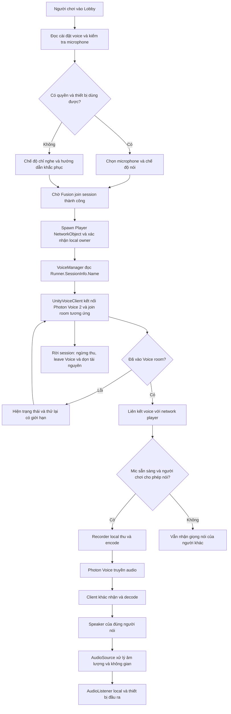

# Thiết kế voice chat — ECHO PROTOCOL

Ngày rà soát: 2026-09-20. Trạng thái: **đã triển khai, biên dịch và đạt 12 kiểm thử tự động; chưa nghiệm thu voice nhiều máy**.

Tài liệu diễn giải và bổ sung luồng người dùng cung cấp: vào Lobby → chuẩn bị microphone → kết nối Photon Voice theo session Fusion → thu/phát giọng nói → âm thanh theo khoảng cách. Các giá trị mặc định dưới đây là đề xuất để thử nghiệm, chưa phải yêu cầu đã được chốt.

**Lựa chọn đã chốt:** dùng **Photon Voice 2** cho voice chat; Fusion chỉ quản lý session, player và network gameplay. Photon Voice 2 đảm nhiệm thu, encode, truyền, nhận và decode giọng nói; Unity AudioSource/AudioListener đảm nhiệm phát và định vị âm thanh.

**Cách nối đề xuất theo luồng người dùng:** `VoiceManager` đọc session Fusion đã join thành công, rồi điều khiển một Voice client riêng. Tài liệu dùng `UnityVoiceClient` làm phương án thiết kế. Photon Voice 2 hỗ trợ hoạt động độc lập. `FusionVoiceClient` cũng là một adapter của Photon Voice 2, không truyền audio qua Fusion; nếu chọn adapter này sau đó, nó phải là đầu mối duy nhất điều khiển join/leave thay cho logic tương ứng trong `VoiceManager`. [Photon Voice 2 — VoiceConnection và UnityVoiceClient](https://doc.photonengine.com/voice/v2/getting-started/voice-intro).

## 1. Hiện trạng và phạm vi

| Thành phần | Kết quả kiểm tra repository |
| --- | --- |
| Unity | `6000.5.8f1`, theo `KLTN/ProjectSettings/ProjectVersion.txt` |
| Fusion | Đã có SDK trong `KLTN/Assets/Photon/Fusion` |
| Photon Voice | Đã cài Photon Voice 2.63 qua UPM, khóa commit `1b93daae7984009cedc51f761a198d145fcf44ad` từ repository Photon chính thức |
| Session | `NetworkBootstrap` sở hữu Runner, tạo/join/leave room và phát `SessionStateChanged` |
| Lobby | `LobbyManager` đọc trạng thái Fusion và gọi chuyển sang scene `SciFi` |
| Player | `FusionPlayerLifecycle` spawn player với input authority và `DontDestroyOnLoad` |
| Camera | `PlayerCamera` có logic quản lý `AudioListener`; cần kiểm tra listener thực tế khi đổi scene/spectate |
| SRS | Đã cập nhật voice chat thành phần mở rộng được yêu cầu triển khai |
| Backend | Chưa đề xuất endpoint mới; transport âm thanh thuộc Photon Voice |

Không coi trường `AppIdVoice` trong Photon Realtime là bằng chứng đã cài Photon Voice. Khi triển khai cần cài Photon Voice 2, cấu hình Voice App ID riêng và kiểm tra tương thích thư viện Photon Realtime đang có. Phương án Voice client độc lập không yêu cầu dùng PUN cho gameplay. [Cài đặt Photon Voice 2](https://doc.photonengine.com/voice/v2/getting-started/voice-intro).

## 2. Rà soát luồng ban đầu

Luồng chính hợp lý nhưng cần bổ sung:

1. Không có quyền mic hoặc không có thiết bị: vẫn cho vào phòng và nghe đồng đội; chỉ khóa chiều gửi.
2. Chờ Fusion join session thành công trước khi join Voice. Vào scene Lobby chưa đủ để xác định room.
3. Voice room và Fusion session dùng hai kết nối dịch vụ riêng. `VoiceManager` đồng bộ vòng đời trong phương án này; không gửi mẫu âm thanh qua Fusion RPC. [Fusion voice chat](https://doc.photonengine.com/fusion/v2/concepts-and-patterns/voice-chat).
4. Encode/decode do Photon Voice xử lý. Code game quản lý thiết bị, trạng thái, UI và vị trí âm thanh.
5. Phải liên kết luồng giọng nói với đúng network player trước khi phát 3D. Speaker đặt ở camera sẽ làm mất vị trí người nói.
6. Spatial audio là bước xử lý của AudioSource trước khi âm thanh ra thiết bị, không phải thao tác sau khi người dùng đã nghe âm thanh.
7. Cần nhánh tắt mic, rút mic, mất kết nối, chuyển scene và rời phòng để tránh ghi âm/phát âm thanh sót lại.



## 3. Thành phần và điểm tích hợp đề xuất

Các lớp ứng dụng đã có trong `Assets/Scripts/Voice/`; `EchoVoiceClient` kế thừa `UnityVoiceClient`. `NetworkBootstrap.Awake` tạo manager duy nhất, không cần gán component vào từng scene.

| Thành phần | Trách nhiệm và vị trí |
| --- | --- |
| `VoiceManager` | Đọc Runner từ `NetworkBootstrap.Instance` mỗi frame, chờ local player rồi điều khiển kết nối/join/leave/retry Voice; không tạo thêm Fusion Runner |
| `UnityVoiceClient` | Kết nối Photon Voice 2 riêng; do `VoiceManager` điều khiển vòng đời |
| `VoiceDeviceController` | Kiểm tra khả năng thu, liệt kê/chọn mic, đổi thiết bị, trạng thái thiếu quyền và mất thiết bị |
| `Recorder` | Một recorder hoạt động trên mỗi client; chỉ input owner được thu/phát |
| `VoicePlayerBinding` | Ánh xạ metadata session + NetworkObject ID sang player hiện hành; chờ tối đa 10 giây nếu player chưa xuất hiện |
| `Speaker` + `AudioSource` | Trên player đại diện người nói ở client nhận, gần vị trí đầu/miệng |
| `VoiceSettingsPanel` | Chọn mic, mức tín hiệu local, mute mic, âm lượng voice, chế độ nói, trạng thái kết nối |

`UnityVoiceClient` dùng `PrimaryRecorder` và `SpeakerPrefab`; game bổ sung logic join room và ánh xạ speaker sang nhân vật. Recorder phải khởi tạo ở trạng thái không thu/không truyền cho đến khi đủ điều kiện. Không chạy đồng thời hai bộ điều khiển kết nối Voice. [Thiết lập client độc lập](https://doc.photonengine.com/voice/v2/getting-started/voice-intro).

### Hợp đồng giữa Fusion và VoiceManager

Luồng đã thống nhất: **Player → join Fusion session → spawn Player NetworkObject → VoiceManager đọc session name → join Photon Voice room**. Chọn đúng Runner của client, kiểm tra session hợp lệ và local player đã bind; không dùng tên room nhập trong UI làm nguồn chuẩn sau khi join.

- Room Voice lấy tên từ `Runner.SessionInfo.Name`. Mọi thành viên phải dùng cùng Voice App ID, Voice AppVersion và vùng Voice thống nhất; chỉ trùng tên room chưa đủ. Đề xuất chọn vùng Voice từ vùng session Fusion thực tế, sau khi kiểm tra vùng đó được Voice hỗ trợ.
- `VoiceManager` kết nối Voice, chờ sẵn sàng matchmaking rồi join-or-create đúng room. Nhiều client có thể vào đồng thời; không phụ thuộc host tạo Voice room trước.
- Tên room dùng để định tuyến, không phải bằng chứng quyền truy cập. Nếu cần phòng riêng, thiết kế xác thực/quyền join Voice tương ứng với thành viên Fusion trước khi phát hành.
- `PlayerRef`, `NetworkObject.Id` và Voice actor number thuộc các miền ID khác nhau; không so sánh trực tiếp. Đề xuất dùng khóa player đã được authority xác nhận, gắn với phiên hiện hành và truyền trong metadata stream được SDK hỗ trợ. `VoicePlayerBinding` đối chiếu metadata với registry player để chọn speaker; metadata tự khai không phải bằng chứng xác thực danh tính.
- Stream đến trước player: giữ chờ có giới hạn, chưa phát ở gốc scene. Player xuất hiện thì bind; player despawn hoặc phiên đổi thì hủy binding. Reconnect phải xây lại ánh xạ actor/stream mới.
- Fusion chỉ cung cấp session, danh tính, trạng thái và transform player. Photon Voice 2 sở hữu toàn bộ luồng audio; bộ phận gameplay không encode/decode hoặc chuyển tiếp gói giọng nói.

### Vòng đời trong project

- **Tạo/join phòng:** `VoiceManager` chờ session và player local sẵn sàng rồi kết nối Voice room. Chỉ cho truyền audio khi session, Voice room, local owner và thiết bị đều sẵn sàng.
- **Spawn player:** bổ sung voice vào prefab hiện có; không spawn thêm gameplay player chỉ để có voice. Liên kết theo ID, không theo tên hiển thị hay thứ tự join.
- **Lobby → SciFi:** Runner/player hiện có cơ chế tồn tại qua scene. Giữ một kết nối và một recorder; cập nhật chế độ 2D/3D, không tự tạo bản sao khi scene mới load.
- **Remote despawn:** tháo speaker/stream của người rời phòng; không tác động mic của người khác.
- **Leave/shutdown:** vô hiệu hóa chiều gửi và ngừng thu trước khi hủy owner; dọn event subscription, retry và speaker còn lại.
- **Join lại:** dùng danh tính/session mới. Callback từ lần join cũ phải bị bỏ qua; không phát audio của room trước.

## 4. Quyền microphone và chọn thiết bị

Target hiện tại là Windows desktop. Thiết kế không giả định mọi nền tảng đều có cùng một hộp thoại xin quyền. Cần đối chiếu microphone backend và phiên bản SDK khi hiện thực.

Trình tự UI đề xuất:

1. Đọc trạng thái mic, thiết bị đã lưu và lựa chọn mute của người chơi.
2. Liệt kê thiết bị từ backend thu âm được chọn. Nếu dùng Unity Microphone, Photon hướng dẫn dùng `Microphone.devices` và đặt thiết bị qua `Recorder.MicrophoneDevice`. Không trộn ID của Unity với backend native. [Thiết lập Recorder](https://doc.photonengine.com/voice/v2/getting-started/recorder).
3. Cho chọn mic và xem mức tín hiệu. Nút kiểm tra mic chỉ thu local; không gửi bản kiểm tra vào room.
4. Nếu không thu được, phân biệt trạng thái không có thiết bị, thiết bị không khả dụng và thiếu quyền khi API cung cấp đủ thông tin. Không suy luận danh sách rỗng luôn có nghĩa người dùng từ chối quyền.
5. Cung cấp hướng dẫn kiểm tra quyền Microphone cho ứng dụng desktop trong Windows và nút thử lại; voice lỗi không chặn ready/start match.

Lưu tên/ID lựa chọn thay vì vị trí trong danh sách. Khi thiết bị đã chọn biến mất, dừng truyền và yêu cầu chọn lại; không âm thầm chuyển sang mic khác. Đổi mic phải ngừng recorder cũ, chọn thiết bị mới rồi khởi động lại khi đủ điều kiện. Trạng thái mute phải được giữ nguyên.

## 5. Chính sách thu và trạng thái UI

Đề xuất mặc định **push-to-talk**, phím cấu hình được qua Unity Input System. Có thể bổ sung chế độ open mic với phát hiện giọng nói; không đồng nhất VAD với mute do người dùng.

Điều kiện gửi đề xuất:

```text
CanTransmit = LocalOwner
           && CurrentFusionSessionIsValid
           && VoiceRoomJoined
           && MicrophoneReady
           && UserEnabledMicrophone
           && !SelfMuted
           && (OpenMicEnabled || PushToTalkHeld)
```

Nhả PTT hoặc mất focus phải đóng cổng truyền. Mute mic dừng thu/phát; muốn giữ meter khi mute phải là chế độ kiểm tra local rõ ràng. Không bật local audio loopback mặc định.

Hiển thị riêng hai nhóm trạng thái để lỗi mic không bị hiểu nhầm là mất mạng:

| Nhóm | Trạng thái |
| --- | --- |
| Kết nối | Disabled, WaitingForSession, Connecting, Joined, Reconnecting, Error |
| Microphone | Unavailable, PermissionRequired, Ready, Muted, Testing |

Biểu tượng “đang nói” của local dựa trên recorder đang truyền; phía remote dựa trên speaker nhận/phát. Không chỉ kiểm tra phím PTT. Nút mute từng đồng đội chỉ ảnh hưởng việc nghe trên client đang thao tác.

## 6. Âm thanh 3D và khoảng cách

Đề xuất Lobby dùng voice 2D để mọi thành viên trao đổi rõ; gameplay dùng proximity 3D. Đây là lựa chọn thiết kế cần chốt trước triển khai.

| Thông số gameplay | Giá trị khởi đầu đề xuất |
| --- | --- |
| `spatialBlend` | 1 |
| `minDistance` | 2 m |
| `maxDistance` | 15 m |
| Rolloff | Linear, hoặc Custom có điểm cuối bằng 0 |
| Doppler | 0 để không làm méo cao độ giọng khi chạy |
| Vị trí speaker | Theo đầu/miệng player remote |
| Listener | Một listener đang bật trên camera local |
| Mixer | Nhóm Voice riêng, tách khỏi jumpscare và ambience |

Không dựa vào `maxDistance` với Logarithmic để bảo đảm im lặng ngoài bán kính. Linear giảm về 0 tại max distance; Custom cần điểm cuối bằng 0. [Unity AudioSource.maxDistance](https://docs.unity3d.com/6000.0/Documentation/ScriptReference/AudioSource-maxDistance.html).

Các khoảng cách trên giả định 1 Unity unit tương ứng 1 m, cần nghe thử trên map SciFi. 3D attenuation không tự xử lý tường/cửa. Occlusion bằng raycast/low-pass là hạng mục mở rộng, không nằm trong luồng cơ bản.

Attenuation tại client cũng không giảm lưu lượng truyền và không bảo đảm người ngoài khoảng cách không nhận được stream. Nếu cần hạn chế phân phối theo khoảng cách, phải thiết kế routing riêng; chưa thuộc đề xuất này.

## 7. Trường hợp lỗi và hành vi mong đợi

| Tình huống | Hành vi |
| --- | --- |
| Không có mic/quyền thu | Chỉ nghe, hiện lý do khi xác định được và nút thử lại |
| Rút mic giữa lúc nói | Ngừng truyền, báo thiết bị không khả dụng; không chuyển mic tự động |
| Voice lỗi, Fusion còn kết nối | Gameplay tiếp tục; retry có backoff và giới hạn; không tạo Runner mới |
| Fusion disconnect | VoiceManager đóng cổng truyền, ngừng thu, rời room và ngắt Voice client |
| Voice join thành công sau khi người chơi đã leave | Bỏ callback cũ và đóng kết nối của phiên đã hết hạn |
| Chuyển scene | Giữ đúng một recorder; speaker theo player, listener theo camera mới |
| Bị bắt/jumpscare | Không tự suy ra thay đổi voice từ âm scream; chính sách voice khi bị bắt cần chốt |
| Downed/Eliminated/Spectating | Cần quyết định ai được nói/nghe và listener theo vị trí nào trước triển khai |

Không tự chuyển âm lượng mic thành `RuntimeNoiseCatalog` để AI nghe người chơi. “Quái nghe mic” là một cơ chế gameplay khác, cần quy tắc authority riêng.

## 8. Điều kiện triển khai và tiêu chí nghiệm thu

Trước khi viết tích hợp: cài Photon Voice 2 và cấu hình Voice App ID; kiểm tra tương thích thư viện dùng chung với Fusion. Chốt hợp đồng định danh player/stream, cấu hình room/region, PTT/open mic, 2D trong Lobby, bán kính nghe và chính sách chết/spectate. Khi đó cập nhật SRS bằng một thay đổi phạm vi rõ ràng.

Kiểm thử trên ít nhất hai client/build và hai thiết bị âm thanh:

1. Host và client cùng session nghe nhau; người ở session khác không nghe được.
2. Host/client đều chỉ thu mic thuộc local owner; không tự nghe bản thân khi loopback tắt.
3. Từ chối quyền hoặc không có mic vẫn vào Lobby, ready, chơi và nghe được.
4. PTT, nhả phím, mất focus, self-mute và mute đồng đội đúng hành vi đã mô tả.
5. Chọn/đổi/rút mic không nhân đôi recorder hoặc tự bật mic đang mute.
6. Lobby → SciFi không nhân đôi stream/listener; định vị trái/phải theo người nói.
7. Kiểm tra gần 2 m, giữa khoảng cách và ngoài 15 m với cấu hình đề xuất; ngoài phạm vi im lặng.
8. Leave/rejoin và lỗi Voice không làm rò âm sang room cũ, không phá kết nối Fusion còn hoạt động.
9. Kiểm tra player despawn, stop Runner và đóng app: mic được giải phóng.
10. Sau khi chốt quy tắc trạng thái sống/chết, kiểm thử Caught, Downed, Eliminated và Spectating.
11. Hai client join đồng thời, Voice reconnect và stream đến trước player đều bind đúng người, không phát nhầm vị trí hoặc nhân đôi tiếng.
12. Sai Voice App ID, AppVersion hoặc region phải hiện lỗi/trạng thái phù hợp; không báo voice sẵn sàng chỉ vì Fusion đã kết nối.

## 9. Triển khai và cách sử dụng

- SDK: `com.photonengine.voice-fusion` 2.63.0, repository chính thức `Photon-Server/Photon-UPM`, commit cố định trong manifest và lockfile. SDK có adapter Fusion nhưng runtime dùng client độc lập. SDK tự thêm assembly `PhotonVoice.Fusion` vào danh sách weaving.
- Mở **Voice settings [F8]**, chọn mic, bật **Enable microphone** rồi đóng bảng. Mặc định PTT là **V**; có thể đổi phím hoặc bật Open mic. Mic mặc định tắt mỗi khi khởi động ứng dụng, không tự bật khi vào phòng.
- Bảng voice dùng IMGUI runtime. Khi mở bảng, movement, camera look, interaction và chiều gửi voice tạm khóa. Âm thanh nhận vẫn tiếp tục.
- **Test microphone locally** thu tối đa 10 giây và chỉ hiển thị meter; không gửi lên Photon hoặc bật loopback. Mute, mất focus, pause, leave và mic không khả dụng đều dừng chiều thu/phát.
- Lựa chọn mic, mute, PTT/open mic và âm lượng được lưu trong PlayerPrefs. Rút mic không tự đổi thiết bị; chọn lại để thử lại.
- Voice room trùng `Runner.SessionInfo.Name`, vùng lấy từ session Fusion, AppVersion riêng `EchoProtocol.Voice.1`, tối đa 4 người. Timeout kết nối là 20 giây, tối đa 3 lần thử; UI có nút Retry.
- Metadata gồm tên session mã hóa Base64 và `NetworkObject.Id.Raw`. Đây là liên kết presentation, không phải xác thực chống giả mạo. Phòng cần bảo vệ phải bổ sung xác thực riêng.
- Speaker theo player cộng offset đầu 1.6 m; Lobby 2D, gameplay 3D, Linear 2–15 m, Doppler 0. Stream mới thay stream cũ cùng player. Mixer riêng tải từ `Resources/Voice/VoiceMixer`.
- Caught/Downed/Eliminated hiện không tự đổi quyền nói; listener theo camera hiện có, kể cả spectate. Chưa áp dụng kênh người chết, occlusion hoặc AI nghe mic.

### Cấu hình từ tài khoản Photon

Tạo ứng dụng **Voice** trong [Photon Dashboard](https://dashboard.photonengine.com/), nhập **App Id Voice** vào Photon App Settings (`Assets/Photon/Fusion/Resources/PhotonAppSettings.asset`). Không dùng Fusion App ID thay Voice App ID. Agent không tạo tài khoản/App ID thay người dùng. Thiếu hoặc sai ID được báo trong UI và không làm dừng Fusion.

Menu Editor: **ECHO Protocol > Setup > Voice Audio Mixer** tạo mixer riêng; **ECHO Protocol > Tests > Voice Chat Rules** chạy kiểm thử cổng thu/phát và định danh stream. Kết quả ghi tại `Temp/VoiceChatTests.xml` và `.txt`.

**ECHO Protocol > Tests > Voice Startup PlayMode** kiểm tra khởi tạo và chặn thu/phát khi chưa có session. Kết quả tại `Temp/VoiceStartupTests.xml` và `.txt`. Các kiểm thử này không bật mic hoặc kết nối tài khoản Photon.

Khi cầu nối MCP không hoạt động, công cụ Editor hỗ trợ request local: tạo `KLTN/Temp/VoiceChatSetup.request` rỗng để chạy setup + EditMode; nội dung `play` để chạy setup + PlayMode. Chỉ dùng khi Editor đã import phiên bản script mới, ngoài Play mode. Request được tiêu thụ một lần; không để file này trong git.

### Xác minh

SDK được Package Manager resolve thành công; Unity 6000.5.8f1 biên dịch được code ứng dụng, Editor và test assemblies. Mixer riêng đã được tạo và xác nhận bằng Unity API. **10/10 EditMode và 2/2 PlayMode đạt, không có test bỏ qua.** Test Runner đã khôi phục scene sau khi chạy.

Chưa chạy Windows player build, kiểm thử hai máy, xác thực phòng hoặc nghe mic thực tế. Voice App ID chưa được cấu hình tại thời điểm kiểm tra; cần hoàn tất bước này rồi thực hiện các kịch bản ở mục 8. Kết quả tự động không chứng minh chất lượng âm thanh hoặc kết nối Photon Cloud thực tế.
Cách dùng: F8 → chọn mic → Enable microphone → đóng bảng → giữ V để nói.